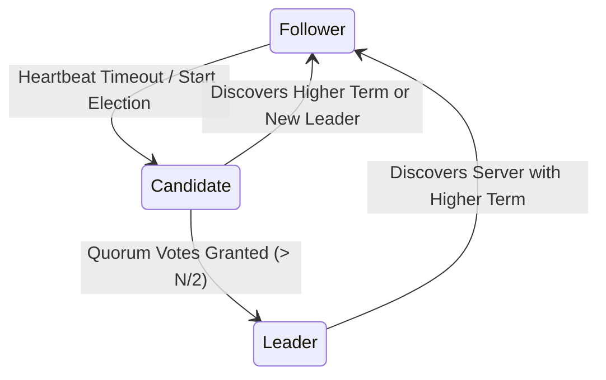

# 35 - Formally Verified Raft Consensus Protocol (TLA+)

## Executive Overview
A formal specification and mathematical safety verification of the **Raft Distributed Consensus Protocol** written in **TLA+ (Temporal Logic of Actions)** by Leslie Lamport. It proves through exhaustive **TLC model checking** that leader election safety holds across all terms: **at most one leader can be elected in any given term**.

## Protocol State Transition Diagram



### Source Tree
- **`src/RaftConsensus.tla`**: Formal TLA+ specification defining servers, terms, vote granting, and state transitions.
- **`src/RaftConfig.cfg`**: TLC model checker configuration file.
- **`runner/run.js`**: State-space model checker simulation verifying invariants across all permutations.

## Formal Safety Invariant in TLA+
```tla
ElectionSafety ==
    \A s1, s2 \in Server :
        (state[s1] = Leader /\ state[s2] = Leader /\ currentTerm[s1] = currentTerm[s2]) => s1 = s2
```

## Native TLC Model Checking
```bash
# Run TLC model checker on specification
tlc src/RaftConsensus.tla -config src/RaftConfig.cfg
```

## Universal Verification
```bash
node runner/run.js
node orchestrator/run.js --project=35-tlaplus
```

## Senior Interview Q&A
- **Q: Why write TLA+ specifications for distributed systems?** Distributed systems are plagued by subtle race conditions and split-brain scenarios that cannot be reliably caught by integration tests. TLC explores every reachable state in the discrete state space, guaranteeing correctness before writing code.
- **Q: How does Raft guarantee that uncommitted log entries are not lost?** Raft enforces the Leader Completeness property: a candidate can only win an election if its log is at least as up-to-date as any other server in a majority quorum.\n